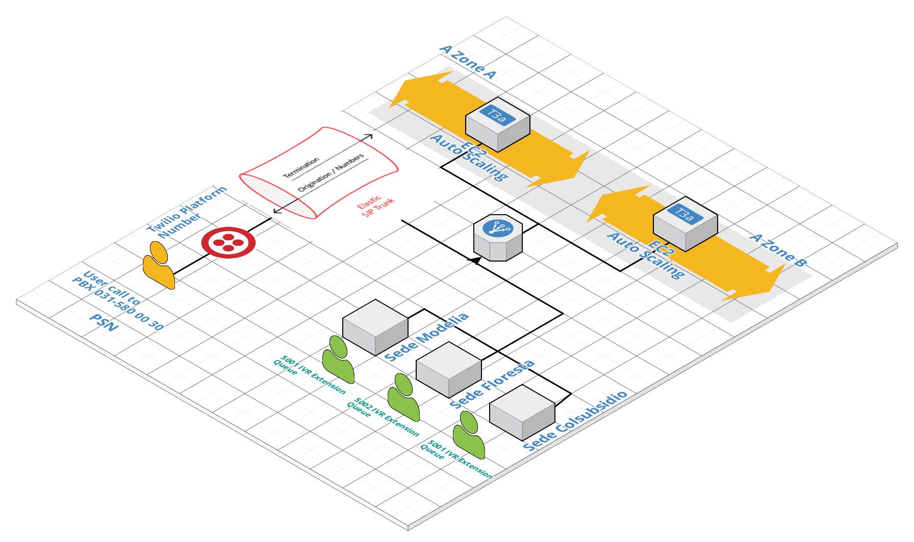
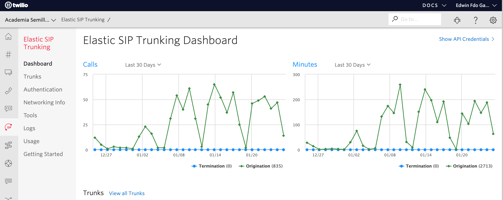
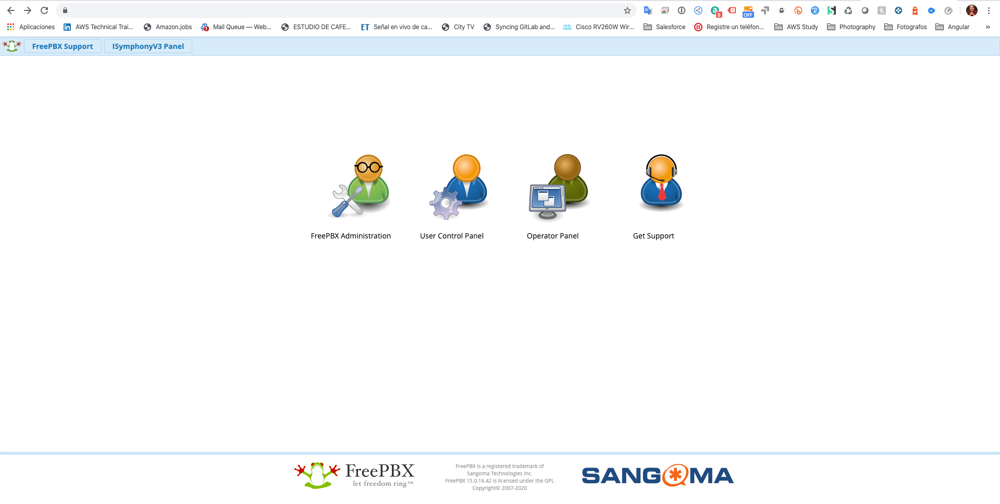
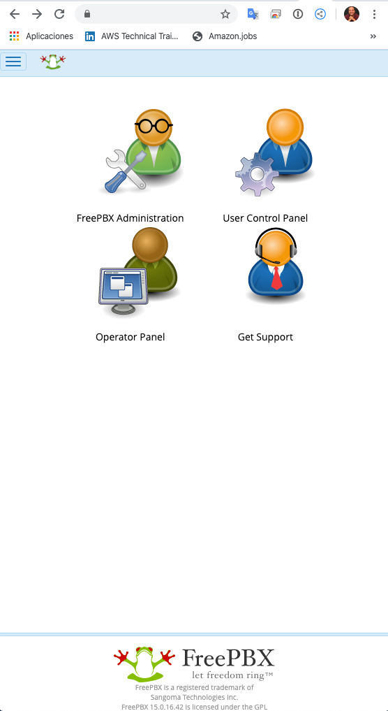

# Voice-IP-telecommunications-architecture.
Voice IP | telecommunications architecture.

VOICE IP telecommunications architecture.
We unify all our offices with a unique phone number +5715800030 from Twilio.com, a PBX managed by Asterix in the Amazon cloud

**Used platforms:**
AWS of course!
Twilio.com, Elastic SIP Trunks, Twilio Phone Number: 031-580-0030

**Services:** EC2, Route 53, CloudFront, Certificate Manager, S3, S3 Glacier, AWS Backup, Aurora RDS

**Features:** Asterix server, IVR, call transfer, call queues, waiting messages, call recording.

**Hardware:** Snom IP phones, Grandstream Phones.

# **Why don't we use Amazon Connect?**
This service does not yet offer local numbers for Colombia.
We are waiting to be able to integrate Amazon Connect with Salesforce at the time they offer local numbers for our country.

----

----

---

